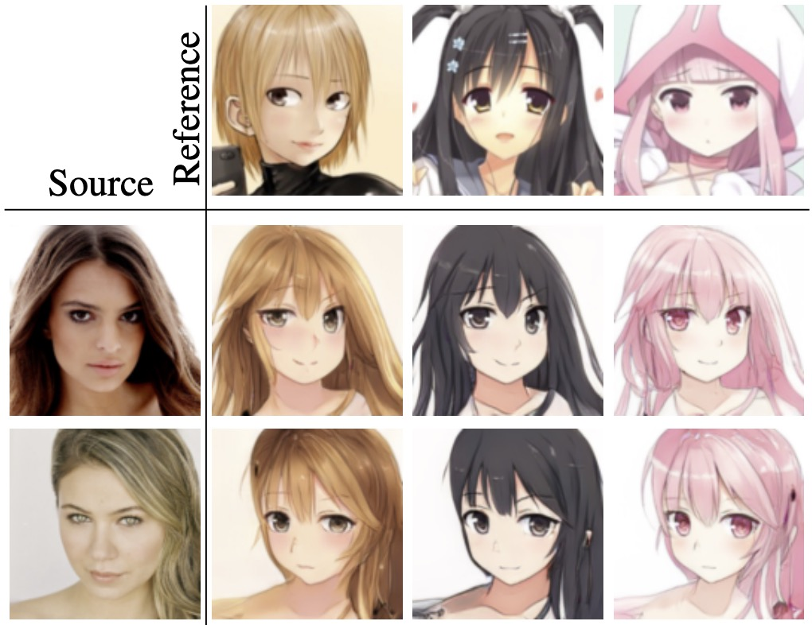
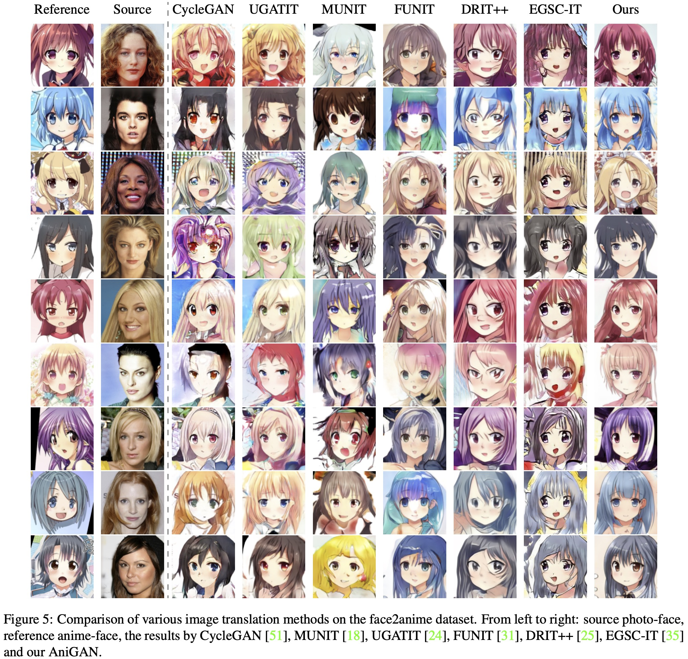

# AniGAN: Style-Guided Generative Adversarial Networks for Unsupervised Anime Face Generation

<p align="center"> 
  
</p>

[**AniGAN: Style-Guided Generative Adversarial Networks for Unsupervised Anime Face Generation**](https://arxiv.org/abs/2102.12593)<br/>

Bing Li<sup>1</sup>,
Yuanlue Zhu<sup>2</sup>,
Yitong Wang<sup>2</sup>,
Chia-Wen Lin<sup>3</sup>,
Bernard Ghanem<sup>1</sup>,
Linlin Shen<sup>4</sup><br/>

<sup>1</sup>*Visual Computing Center, KAUST, Thuwal, Saudi Arabia*<br/>
<sup>2</sup>*ByteDance, Shenzhen, China*<br/>
<sup>3</sup>*Department of Electrical Engineering, National Tsing Hua University, Hsinchu, Taiwan*<br/>
<sup>4</sup>*Computer Science and Software Engineering, Shenzhen University, Shenzhen, China*<br/>


## Installation

```
conda create -n AniGAN python=3.7
conda activate AniGAN
conda install pytorch==1.4.0 torchvision==0.5.0 -c pytorch
pip install PyYAML
```

## Evaluation with pretrained model

* Download pre-trained weights (trained on our `face2anime` dataset) from [Google Drive](https://drive.google.com/file/d/1d-z_tilLa07U2kSQ_vRHw5qjLEeJjCCq/view?usp=share_link) and put it in `src/checkpoints/try4_final_r1p2/`.
* Our method with pretrained weights can be evaluated using the `test.py`:

```
python test.py \
    --source_img SOURCE_IMG_PATH \
    --reference_img REFERENCE_IMG_PATH \
    --output_dir SAVE_PATH
```

* `SOURCE_IMG_PATH`: path of the source image. Two examples are provided: `input_img_examples/1795111.png` and `input_img_examples/2773005.png`.
* `REFERENCE_IMG_PATH`: path of the reference image. Two examples are provided: `input_img_examples/imgHQ11831.png` and `input_img_examples/imgHQ11853.png`.
* `SAVE_PATH`: directory path to save the result image. Optional and default value is `result_dir`.


## Datasets

We build a new dataset called **face2anime**, which is larger and contains more diverse anime styles (e.g., face poses, drawing styles, colors, hairstyles, eye shapes, strokes, facial contours) than selfie2anime. The **face2anime** dataset contains 17,796 images in total, where the number of both anime-faces and natural photo-faces is 8,898. The anime-faces are collected from the Danbooru2019 dataset, which contains many anime characters with various anime styles. We employ a pretrained cartoon face detector to select images containing anime-faces. For natural-faces, we randomly select 8,898 female faces from the CelebA-HQ dataset. All images are aligned with facial landmarks and are cropped to size 128 × 128. We separate images from each domain into a training set with 8,000 images and a test set with 898 images.

You can download the **face2anime** dataset from [Google Drive](https://drive.google.com/file/d/1Exc6QumR2r0aFUtfHOdAgle4F4I9zwF3/view?usp=sharing).


## Citation

If you find this work useful or use the **face2anime** dataset, please cite our [paper](https://arxiv.org/abs/2102.12593):
```bibtex
@article{li2021anigan,
  title={AniGAN: Style-Guided Generative Adversarial Networks for Unsupervised Anime Face Generation},
  author={Li, Bing and Zhu, Yuanlue and Wang, Yitong and Lin, Chia-Wen and Ghanem, Bernard and Shen, Linlin},
  journal={IEEE Transactions on Multimedia},
  year={2021},
  publisher={IEEE}
}
```



